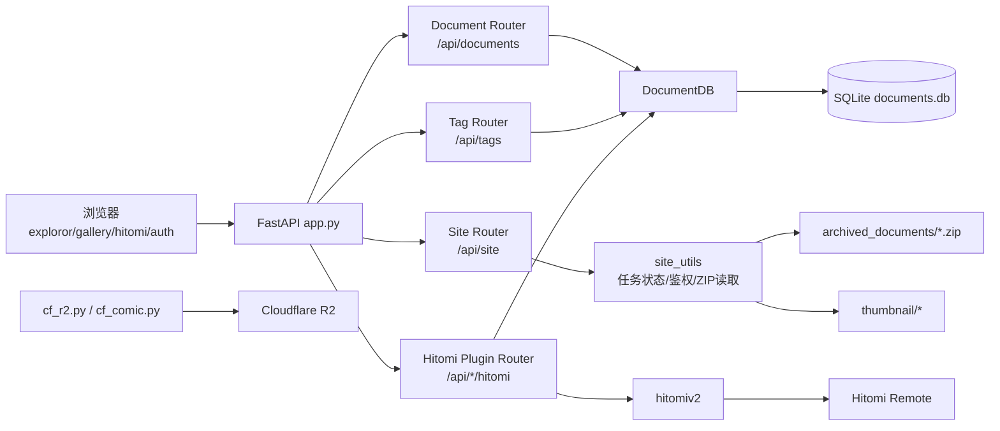
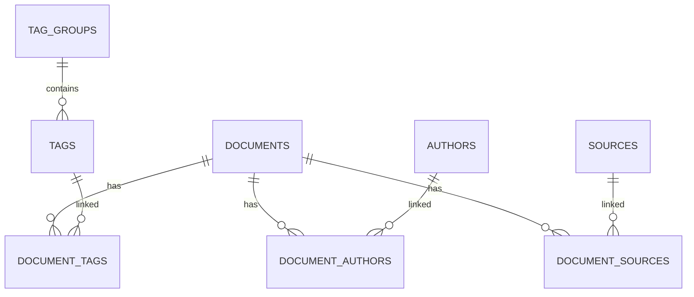

# ComicManager

ComicManager 是一个基于 **FastAPI + SQLModel + SQLite + 原生 JavaScript** 的个人漫画媒体库系统，覆盖了本地归档、元数据管理、在线浏览、标签检索、Hitomi 导入与 R2 云备份能力。

## 功能概览

- 本地漫画库管理：ZIP 漫画包 + SQLite 元数据
- 在线阅读：按页流式读取 ZIP 内图片，不解压全量文件
- 多维检索：按标签、作者、来源 ID 分页查询
- 权限控制：Cookie Token + 能力位（RBAC）
- 插件扩展：Hitomi 插件按需加载，失败不影响主服务
- 后台任务：Hitomi 元数据刷新、下载进度实时查询
- 云备份：Cloudflare R2 分块上传、断点续传与批量下载

## 技术栈

- 后端：`FastAPI`、`Pydantic`、`SQLModel`、`SQLAlchemy`
- 前端：原生 `JavaScript` + `HTMX` + `Viewer.js`
- 数据库：`SQLite`（外键约束开启）
- 存储：本地 `ZIP` 文件、`thumbnail/` 缩略图
- 云存储：`boto3` + Cloudflare R2（S3 兼容）
- 其他：`httpx`（Hitomi 通讯）、`aiofiles`、`natsort`

## 架构总览



## 目录与模块职责

| 路径 | 角色 |
|---|---|
| `app.py` | FastAPI 主入口、生命周期管理、主路由注册 |
| `document_sql.py` | SQLModel 实体与关联表定义 |
| `document_db.py` | `DocumentDB` 数据访问层、分页查询与维护脚本 |
| `site_utils.py` | 鉴权、ZIP 读取、缩略图生成、缓存响应 |
| `hitomi_plugin.py` | Hitomi 插件路由、后台下载任务、标签补录流程 |
| `hitomiv2.py` | Hitomi 协议适配：检索、详情解析、图片 URL 解码、下载 |
| `log_comic.py` | 命令行导入工具（交互式标签补录 + 下载入库） |
| `cf_r2.py` | Cloudflare R2 上传/下载/列举/分块续传 |
| `cf_comic.py` | 漫画对象级 R2 包装 |
| `src/` | 前端 JS/CSS（检索页、录入页、Hitomi 工具） |
| `templates/` | HTML 模板（检索、阅读、登录、状态页等） |
| `API_DOCUMENTATION.md` | API 详细说明 |

## 后端分层设计

### 1) 入口与路由层（`app.py`）

- 自定义 `/docs` 与 `/openapi.json`，并统一套用鉴权依赖
- 主路由：
  - `/api/documents`：文档查询、元数据、分页、内容读取、删除
  - `/api/tags`：标签组与标签查询
  - `/api/site`：站点级接口（下载状态）
- 页面路由：
  - `/exploror`、`/show_document/{id}`、`/show_status`、`/HayaseYuuka`
- 生命周期：
  - 若 `hitomi_plugin` 可导入，则启动 `refresh_hitomi_loop()` 后台刷新任务

### 2) 数据访问层（`document_db.py`）

- `DocumentDB` 封装会话与查询：
  - `query_by_tags()` / `query_by_author()` Builder 风格查询
  - `paginate_query()` 统一分页计数与切片
  - `search_by_source()` 支持来源 ID 精确定位
  - `add_document()` / `edit_document()` / `delete_document()`
  - `link_document_tag()` / `link_document_source()`
- 每次连接执行 `PRAGMA foreign_keys=ON`
- 提供 FastAPI 依赖 `get_db()`

### 3) 领域模型层（`document_sql.py`）

- 核心实体：
  - `Document`、`Author`、`Tag`、`TagGroup`、`Source`
- 关联表：
  - `DocumentAuthorLink`
  - `DocumentTagLink`
  - `DocumentSourceLink`（含 `source_document_id` payload）
- 索引：
  - `documents.title`、`(series_name, volume_number)`、`source_document_id` 唯一索引等

### 4) 基础设施层（`site_utils.py`）

- 鉴权与授权：
  - `auth.json` + Cookie `auth_token`
  - `Authoricator` 支持能力位校验
- 内容读取：
  - `get_zip_namelist()`、`get_zip_image()`
  - `create_content_response()` 统一返回图片/缩略图
- 缓存策略：
  - `ETag` + `If-None-Match` + `304 Not Modified`
  - `Cache-Control: public, max-age=2678400`
- 全局任务状态：
  - `task_status: dict[str, TaskStatus]`

## 数据模型关系



关键点：

- 漫画正文以 `MD5.zip` 存于 `archived_documents/`
- `thumbnail/` 目录用于缩略图缓存；`create_content_response(..., -1)` 支持生成 WebP（当前主路由 `/api/documents/{id}/thumbnail` 走第 0 页内容）
- `document_sources.source_document_id` 全局唯一，用于防重复导入

## 前端架构

- `templates/exploror.html` + `src/exploror.js`
  - 标签组加载、条件检索、分页、浏览器历史同步
  - 列表项使用 HTMX 延迟请求 `/api/documents/{id}` 渲染详情
- `templates/gallery.html`
  - 拉取 `/api/documents/{id}` 获取页面 URL 列表
  - Viewer.js 实现缩放，支持键盘与触摸翻页
- `templates/hitomi.html` + `src/hitomi_utils.js`
  - Hitomi 搜索与导入入口
- `templates/add_hitomi_comic.html` + `src/add_comic.js`
  - 缺失标签补录与提交流程
- `templates/show_download_status.html`
  - 轮询 `/api/site/download_status` 展示后台任务进度

## Hitomi 插件架构

`hitomi_plugin.py` 提供三组子路由：

- `/api/documents/hitomi/*`：搜索、查询已导入文档、提交导入
- `/api/tags/hitomi/*`：缺失标签检测
- `/api/site/hitomi/*`：下载 URL 解码

导入流程：

1. 前端提交 Hitomi ID 与缺失标签映射
2. 后端校验是否已存在（`source_document_id`）
3. 解析远端标签并补齐本地 Tag
4. 后台任务下载 ZIP，实时写入 `task_status`
5. 计算 MD5、移动至归档目录、写入 DB、关联 Tag/Author/Source

## 云备份与外部存储

`cf_r2.py`：

- 读取 `r2.json` 初始化 S3 Client
- `uploadFile()`：分块 + 多线程上传，支持断点续传
- `download()`：调用 `aria2c` 并发下载
- `listFiles()`：分页遍历 Bucket 对象

`cf_comic.py`：

- 对漫画目录前缀 `comic/` 做轻量封装

## 快速开始

### 1. 安装依赖

```bash
pip install -r requirements.txt
```

### 2. 启动服务

```bash
uvicorn app:app --host 0.0.0.0 --port 8000
```

### 3. 访问入口

- 首页：`/`（重定向到 `/exploror`）
- 登录/Token 设置页：`/HayaseYuuka`
- 文档页：`/docs`（需登录）

## 配置说明

### `auth.json`（鉴权）

结构：

```json
{
  "users": {
    "<token>": {
      "username": "name",
      "abilities": ["document.create", "document.delete"],
      "admin": true
    }
  }
}
```

说明：

- Cookie 名称固定为 `auth_token`
- 若未配置 `auth.json`，系统默认放行（开发模式）
- 生产环境建议关闭默认放行并替换默认 token

### `r2.json`（云备份）

需包含：

- `access_key_id`
- `secret_access_key`
- `endpoint_url`
- `bucket_name`
- `region_name`
- `bucket_url`

## API 与页面路由

- API 详细文档：`API_DOCUMENTATION.md`
- 主要前缀：
  - `/api/documents`
  - `/api/tags`
  - `/api/site`
  - `/api/*/hitomi`（插件启用时）

## 开发与维护脚本

- `build_test_data.py`：生成测试库、测试 ZIP、缩略图
- `log_comic.py`：CLI 导入 Hitomi 漫画
- `document_db.py`（CLI）：
  - `clean`、`fix_hash`、`hitomi_update`、`export`、`edit`
- `cf_r2.py`：R2 上传下载调试入口
- `qodana.yaml`：静态检查配置（`jetbrains/qodana-python:2025.3`）

## 当前状态说明

- `nhentai_plugin.py` 已存在但当前未在 `app.py` 中挂载
- `recovery_from_db.py` 仍依赖旧 `Comic_DB`，属于历史迁移脚本，不在当前主链路

## License

项目内包含 `LICENSE` 文件，请按其中条款使用。
